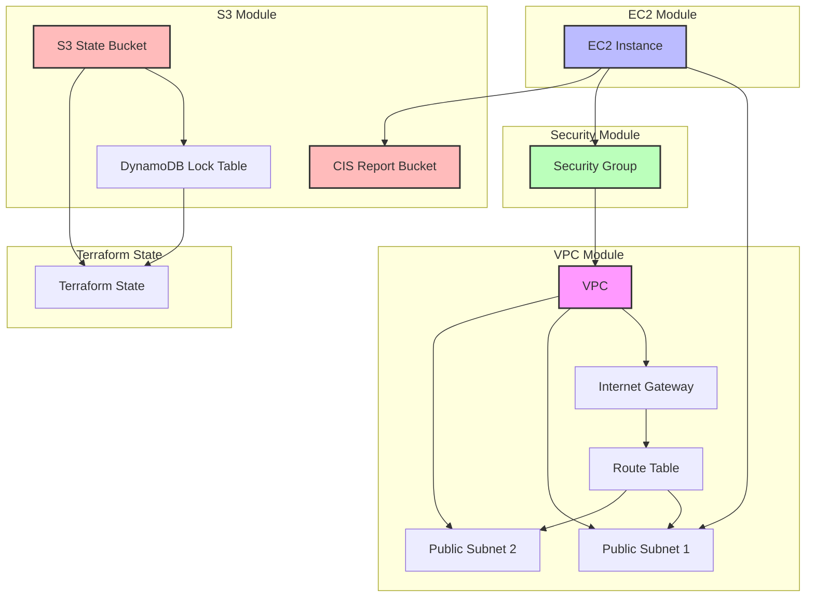

# Infrastructure Architecture

## Resource Dependencies

1. **VPC Module**
   - VPC is the foundation for all networking
   - Internet Gateway provides internet connectivity
   - Route Table defines network routing
   - Public Subnets are created in different AZs

2. **Security Module**
   - Security Group depends on VPC
   - Defines inbound and outbound rules

3. **EC2 Module**
   - EC2 Instance depends on:
     - Public Subnet for network placement
     - Security Group for access control

4. **S3 Module**
   - State Bucket and DynamoDB for Terraform state management
   - CIS Report Bucket for storing benchmark results
   - EC2 Instance uploads reports to CIS Bucket

5. **Terraform State**
   - Managed by S3 and DynamoDB
   - Ensures state locking and versioning 