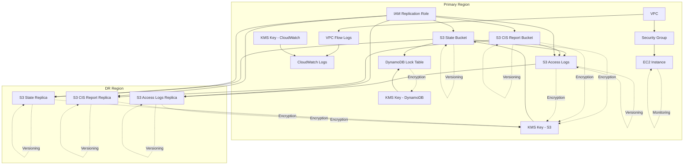

# Infrastructure Architecture

## Resource Dependencies

## Security Features

### KMS Key Management
- Separate KMS keys for S3, DynamoDB, and CloudWatch
- Automatic key rotation enabled
- Custom key policies for access control

### S3 Bucket Protection
- Server-side encryption using customer-managed KMS keys
- Versioning enabled for data protection
- Public access blocks to prevent unauthorized access
- Access logging enabled for audit trails
- Cross-region replication for disaster recovery
- Self-logging for access logs bucket

### Network Security
- VPC Flow Logs with 1-year retention
- CloudWatch logs encrypted with KMS
- Private subnets for sensitive resources
- NAT Gateway for secure outbound access
- No automatic public IP assignment

### Instance Security
- IMDSv2 required with token-based access
- Detailed monitoring enabled
- EBS optimization enabled
- Root volume encryption
- Security group with least privilege
- Latest Amazon Linux 2 AMI

### State Management
- Remote state stored in S3 with encryption
- State locking using DynamoDB with encryption
- Separate KMS keys for different services
- Point-in-time recovery enabled for DynamoDB

### Access Control
- IAM roles with least privilege principle
- Separate roles for replication and access
- KMS key rotation enabled
- Resource tagging for tracking

### Monitoring and Audit
- VPC Flow Logs with 1-year retention
- S3 access logging enabled
- DynamoDB point-in-time recovery
- EC2 detailed monitoring
- Resource tagging for tracking
- Regular security scanning with tfsec 